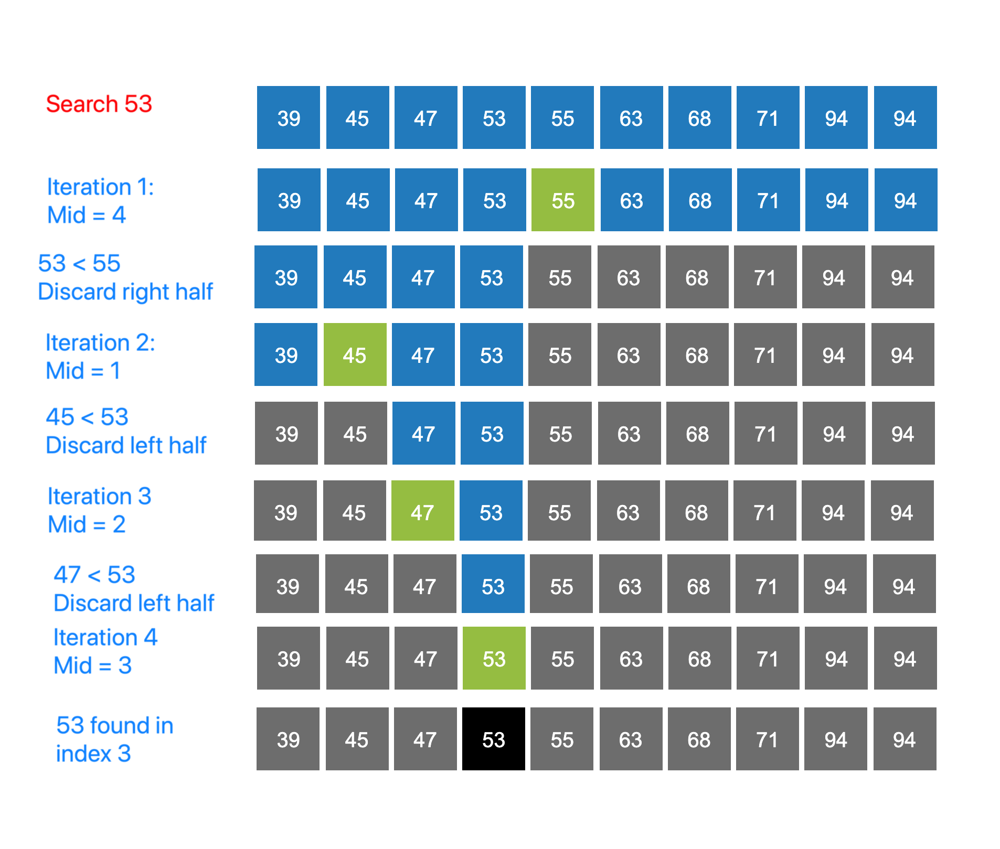

### Binary Search Concept

<iframe src="https://www.youtube.com/embed/SYaVzxkGFsE" frameborder="0" allow="autoplay; encrypted-media" allowfullscreen></iframe>

### Idea

Binary Search uses the ordering of a sorted array to reduce the search space rapidly.

Suppose we have a sorted array and want to search for a target element $x$. Instead of checking every element sequentially, Binary Search examines the middle element of the current search interval.

Depending on the comparison with the target, approximately half of the remaining elements can be discarded.

The process is:

1. Start with an interval covering the entire sorted array.
2. Find the middle element of the interval.
3. If the middle element is equal to the target, the search is successful.
4. If the target is smaller than the middle element, continue searching in the left half.
5. If the target is greater than the middle element, continue searching in the right half.
6. Repeat until the target is found or the search interval becomes empty.

### Why Must the Array Be Sorted?

Binary Search depends on the ordering of the array.

For example, if the array is sorted in ascending order and:

$(A[mid] < x)$

then every element to the left of `mid` is also smaller than $x$. Therefore, the left half can be safely discarded.

Similarly, if:

$(A[mid] > x)$

then every element to the right of `mid` is greater than $x$, so the right half can be discarded.

This reasoning is not valid for an arbitrary unsorted array.

Therefore:

> **The array must be sorted before the standard Binary Search algorithm is applied.**

### Sorting as Preprocessing

If the input array is initially unsorted, sorting can be performed as a preprocessing step:

$(\text{Unsorted Array} \rightarrow \text{Sorting} \rightarrow \text{Sorted Array} \rightarrow \text{Binary Search})$

It is important to distinguish the two operations:

- **Sorting** prepares the data by establishing the required order.
- **Binary Search** uses that order to perform an efficient search.

Sorting is therefore not itself a step of the Binary Search algorithm.

### Why Is Binary Search Faster?

At each iteration, Binary Search reduces the search interval to approximately half its previous size:

$(N \rightarrow \frac{N}{2} \rightarrow \frac{N}{4} \rightarrow \frac{N}{8} \rightarrow \cdots)$

After $k$ iterations, approximately:

$(\frac{N}{2^k})$

elements remain.

When the search interval becomes sufficiently small:

$(\frac{N}{2^k} \approx 1)$

which gives:

$(k \approx \log_2 N)$

Hence, the worst-case time complexity of Binary Search is:

$(O(\log N))$

### Important Observations

Let's take note of a few important observations:

- Binary Search requires the array to be sorted.
- Binary Search uses the ordering of the array to eliminate a portion of the search space at every iteration.
- The search interval is approximately halved after each comparison.
- If the target is found at the first middle-element comparison, the best-case time complexity is $O(1)$.
- The worst-case time complexity is $O(\log N)$.
- Iterative Binary Search requires $O(1)$ auxiliary space.

### Step-by-Step Process for Binary Searching an Element

The visualization demonstrates how the search interval becomes smaller after each comparison.
