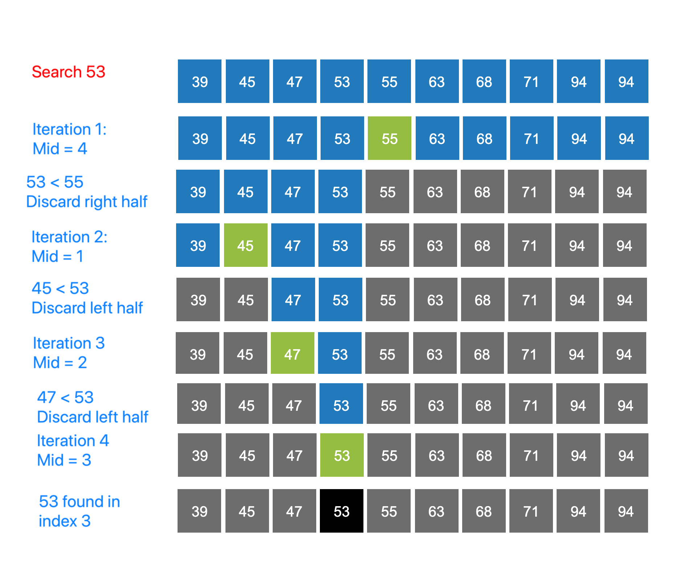

### Binary Search Concept
<iframe src="https://www.youtube.com/embed/SYaVzxkGFsE" frameborder="0" allow="autoplay; encrypted-media" allowfullscreen></iframe>

### Idea
The idea of binary search is to use the information that the array is sorted and reduce the time complexity to O(Log n). In Binary search, we adopt the following strategy:

   - Sort the array elements.
   - Search a sorted array by repeatedly dividing the search interval in half.
   - Begin with an interval covering the whole array.
   - If the value of the search key is less than the item in the middle of the interval, narrow the interval to the lower half.
   - Otherwise narrow it to the upper half. Repeatedly check until the value is found or the interval is empty.

### Important Observations
 Let's take note of a few important observations:

   - It is crucial for the element array to be sorted to be able to search for a query element.
   - We jump intervals and prune out the array intervals that we are sure will not contain the query element
   - If the element is not present in the array we are guaranteed that the algorithm returns failure.

### Step by Step Process for Binary Searching an Element

