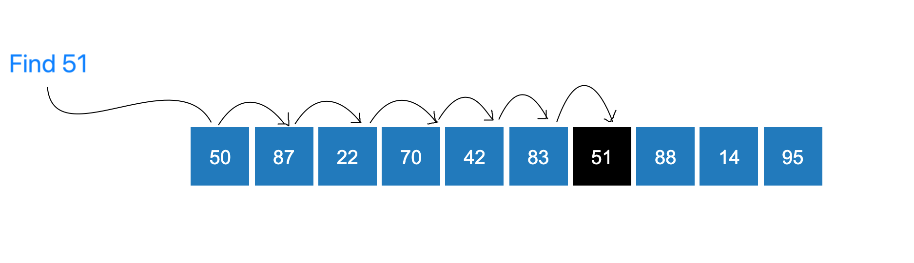

### Linear Search Concept

<iframe src="https://www.youtube.com/embed/CFV2jm0zD8E" frameborder="0" allow="autoplay; encrypted-media" allowfullscreen></iframe>

### How Can We Search for an Element in an Array?

Linear Search is a straightforward searching technique in which the elements of an array are examined sequentially until the required element is found or all elements have been examined.

Suppose the array contains $N$ elements and the target element is $x$.

The search proceeds as follows:

- Start from the first element of the array.
- Compare the current element with the target $x$.
- If the elements match, report the index of the matched element.
- Otherwise, move to the next element.
- Continue until the target is found or the entire array has been examined.

### Why Does Linear Search Work on an Unsorted Array?

Linear Search does not depend on the relative ordering of the elements.

For example, consider:

$(A = [18, 4, 27, 9, 13])$

To search for $13$, Linear Search can examine the elements one by one:

$(18 \rightarrow 4 \rightarrow 27 \rightarrow 9 \rightarrow 13)$

The target can be found even though the array is not sorted.

Therefore:

> **Linear Search can be directly applied to both sorted and unsorted arrays.**

### When Should We Stop?

The search stops in either of the following situations:

1. The target element is found.
2. Every element has been examined and the target is not present.

If the target is found at index $i$, the algorithm can return that index without examining the remaining elements.

If all $N$ elements are examined without finding the target, the algorithm reports failure.

### Important Observations

A few important observations about Linear Search are:

- No ordering of the array elements is required.
- The algorithm examines elements sequentially.
- In the best case, the target is the first element examined, so the search takes $O(1)$ time.
- In the worst case, the target is the last element or is not present, so all $N$ elements may need to be examined. Therefore, the worst-case time complexity is $O(N)$.
- An iterative Linear Search requires only a constant amount of auxiliary memory, giving an auxiliary space complexity of $O(1)$.

### Step-by-Step Process for Searching an Element

The step-by-step process demonstrates how the search proceeds from one element to the next until a match is found or the array is exhausted.
