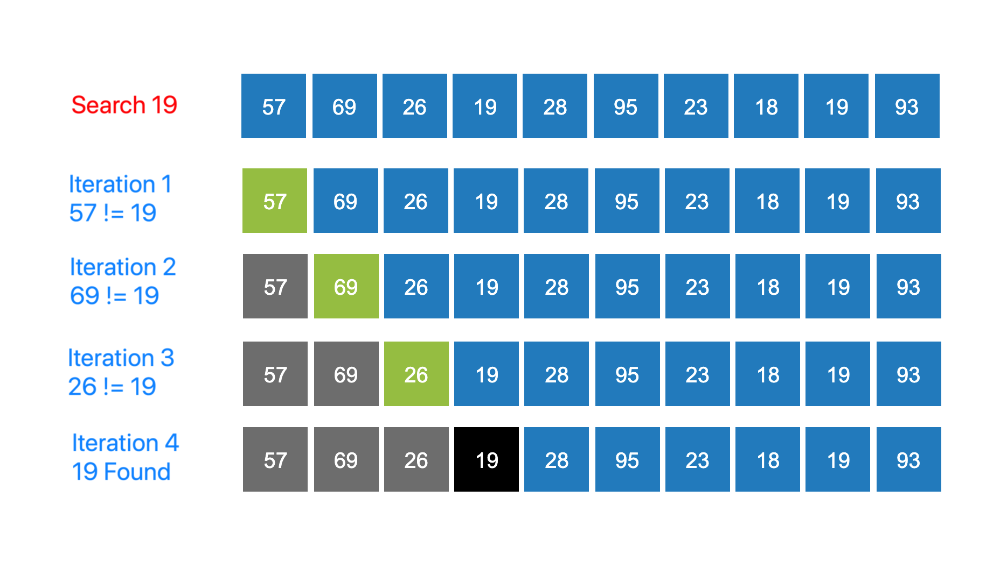

### Linear Search Algorithm
<iframe src="https://www.youtube.com/embed/_e3bkK5cMY4" frameborder="0" allow="autoplay; encrypted-media" allowfullscreen></iframe>
### Observations

All the elements are compared untill a successfull match is found.

### Iteration by Iteration Visualization of Linear Search

### Linear Search Algorithm
Let's have a final look at the consolidated algorithm to search for an element in an array of N elements:

   - **STEP 1** : Start from the leftmost element of list and one by one compare the query element with each element of the list.
   - **STEP 2** : If the query element matches with an element, return the index.
   - **STEP 3** : If the query element doesn’t match with any of elements, return failure.

