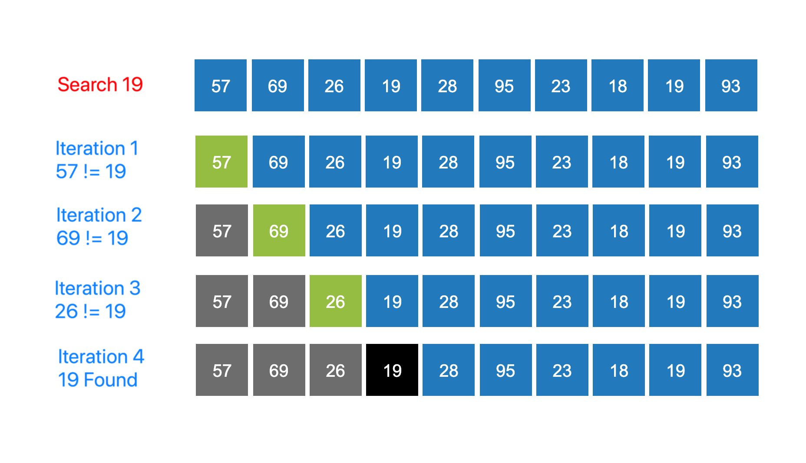

### Linear Search Algorithm

<iframe src="https://www.youtube.com/embed/_e3bkK5cMY4" frameborder="0" allow="autoplay; encrypted-media" allowfullscreen></iframe>

### Observations

Linear Search compares the target element with the array elements sequentially.

The number of comparisons depends on the position of the target:

- If the target is found immediately, only one comparison may be required.
- If the target is near the end, many comparisons are required.
- If the target is absent, all $N$ elements may need to be examined.

### Iteration-by-Iteration Visualization of Linear Search

### Linear Search Algorithm

Let's have a final look at the consolidated algorithm for searching for an element in an array of $N$ elements:

- **STEP 1:** Start from the leftmost element of the array and compare it with the query element.
- **STEP 2:** If the query element matches the current element, return its index.
- **STEP 3:** If the query element does not match the current element, move to the next element and repeat Step 2.
- **STEP 4:** If all $N$ elements have been examined without a match, report failure.

### Complexity of Linear Search

For an array of $N$ elements:

- **Best-case time complexity:** $O(1)$
- **Worst-case time complexity:** $O(N)$
- **Auxiliary space complexity for the iterative algorithm:** $O(1)$

Linear Search is particularly useful when the array is unsorted and only a small number of searches are required, because no preprocessing or sorting is necessary.
