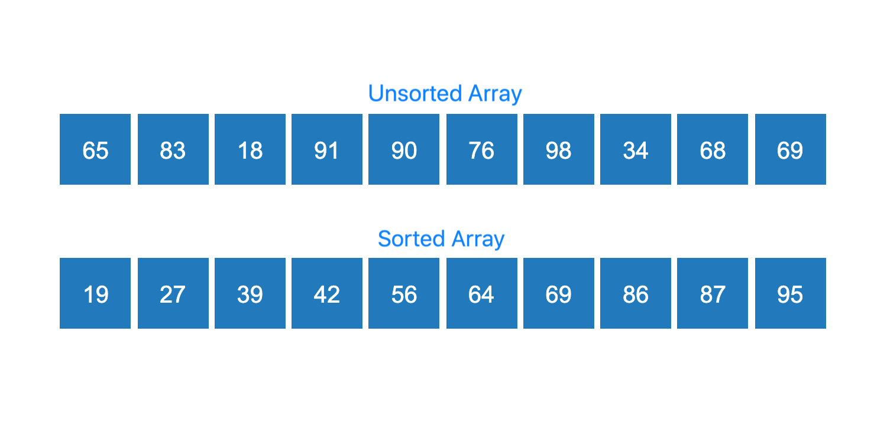

### What is Sorting?

A given list of numbers is said to be **sorted** if its elements are arranged in either **ascending** or **descending** order. By default, we usually consider ascending order unless stated otherwise.

For example:

- Unsorted array: $[8, 3, 12, 5, 1]$
- Sorted in ascending order: $[1, 3, 5, 8, 12]$
- Sorted in descending order: $[12, 8, 5, 3, 1]$

### Unsorted and Sorted Arrays

The ordering of an array is important because some algorithms can exploit this ordering to reduce the amount of work required.

Linear Search does **not** require the array to be sorted. Binary Search, on the other hand, requires the array to be sorted according to the ordering used by the search.

### Time and Space Complexity

**Time complexity** describes how the running time or number of basic operations performed by an algorithm grows as a function of the input size.

**Auxiliary space complexity** describes the additional memory required by an algorithm apart from the memory used to store the input.

For an array containing $N$ elements, if an algorithm examines every element once, its time complexity is:

$(O(N))$

If an algorithm uses two nested loops and each loop may iterate $N$ times, the number of operations can grow proportionally to:

$(N \times N = N^2)$

and its time complexity is:

$(O(N^2))$

In this experiment, we will use these ideas to understand why Linear Search has a worst-case time complexity of $O(N)$ and why Binary Search has a worst-case time complexity of $O(\log N)$ when applied to a sorted array.
