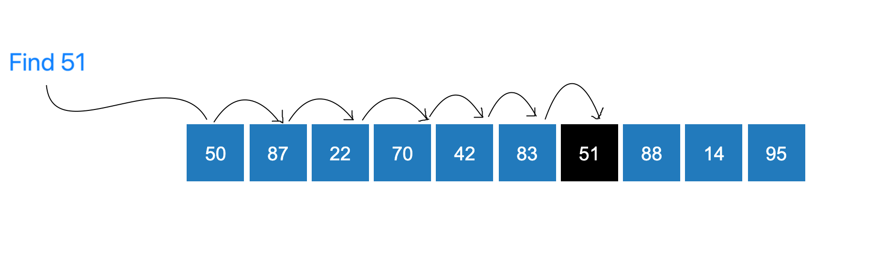
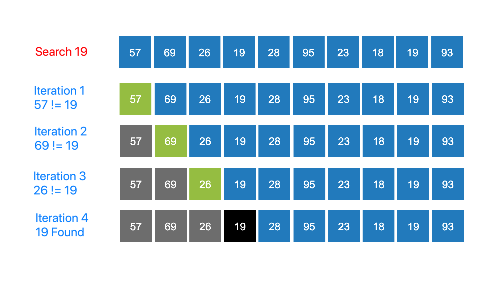

### Linear Search Concept
<iframe src="https://www.youtube.com/embed/CFV2jm0zD8E" frameborder="0" allow="autoplay; encrypted-media" allowfullscreen></iframe>

### How can we search an element in an array?
In linear search, we adopt the most naive method for searching.

   - We look through the array in an orderly fashion, comparing each element with the element we would like to find, namely the query element.
   - Whenever we find a matching element, we report the index of the matched element
   - If we have traversed the entire array and not found a matching element, we report that the element is not present in the array.

### When should we stop?

### Important Observations
Let's take note of a few important observations :

   - We do not require any ordering of the elements of the array to find a particular element in the array.
   - This is because we iterate through the entire array for searching the element, so we are guaranteed to find the element if it present in the array.
   - If the element is not present in the array we are guaranteed that the algorithm returns failure.

### Step by Step Process for Searching an Element

