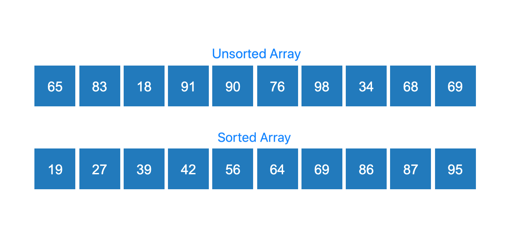

### What is Sorting?

A given list of numbers is said to be sorted if the numbers are **ordered** either in **ascending** or **descending** order. By default, we sort the numbers in ascending order.
### Unsorted and Sorted arrays

### Time and Space Complexity
   - Time complexity of an algorithm gives the measure of time taken by it to run as a function of the length of the input. Similarly, Space complexity of an algorithm quantifies the amount of space or memory taken by an algorithm to run as a function of the length of the input.
   - Recall that suppose our input is an array of N elements, and our algorithm iterates through the array once, time complexity will be O(N). If I run two embedded loops to traverse the array N times, time complexity will be O(N2).

